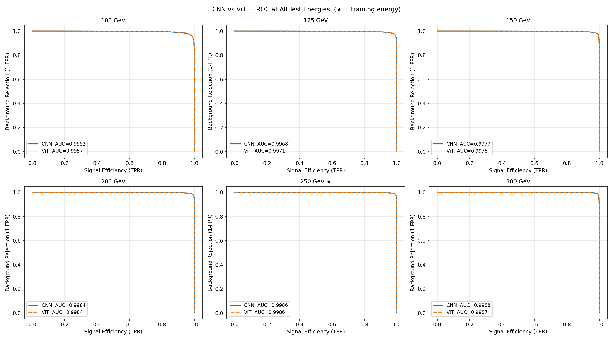
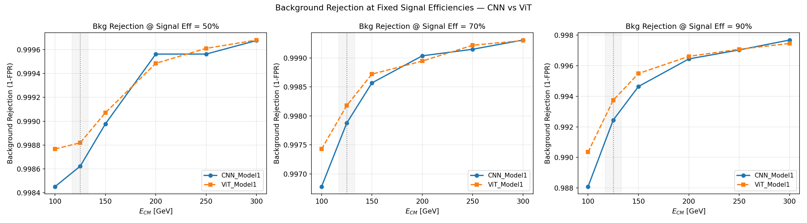
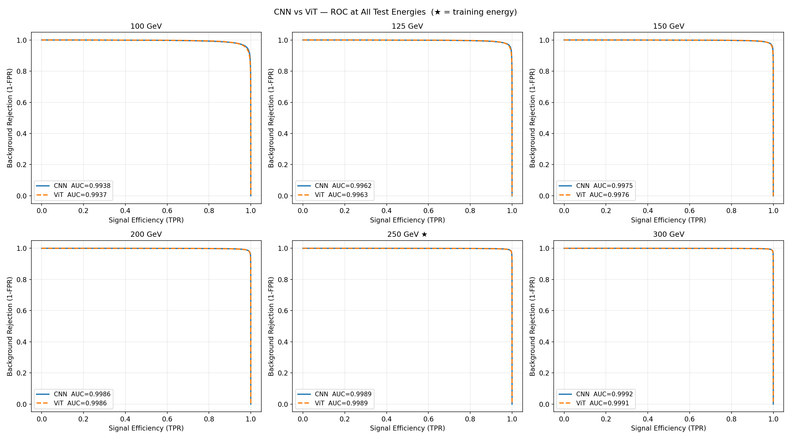
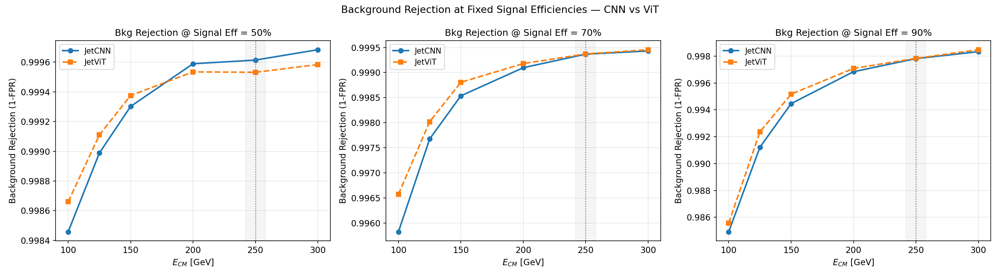

# Hadronic Tau Jet Tagging at an e⁺e⁻ Collider using Deep Learning

A deep learning study for hadronic tau jet identification in e⁺e⁻ collisions using the ILD
detector simulation. Models are trained on jet images and tabular jet features and evaluated
across a range of centre-of-mass energies to probe cross-energy generalisation. This project
is part of an MSc upgrade and is **actively being developed — results and documentation will
be updated regularly**.

---

## Physics motivation

### The tau lepton

The tau (τ) is the third-generation charged lepton in the Standard Model:

- Discovered by **Martin Perl** in 1975 at SLAC
- Heaviest lepton: mass ≈ **1777.6 MeV**
- Very short lifetime: ≈ **2.90 × 10⁻¹³ s**
- Nearly **64.8%** of tau decays are hadronic, producing narrow, collimated **tau jets**

### The process: e⁺e⁻ → τ⁺τ⁻

The relevant QED Lagrangian for this process is:

$$\mathcal{L}^{\text{QED}} = \mathcal{L}_e^{\text{Dirac}} + \mathcal{L}_\tau^{\text{Dirac}} + \mathcal{L}^{\text{Maxwell}} + \mathcal{L}^{\text{Int}}$$

where the interaction term is:

$$\mathcal{L}^{\text{Int}} = -e\,\bar{\hat{\psi}}_e\,\gamma^\mu\hat{\psi}_e\hat{A}_\mu \;-\; e\,\bar{\hat{\psi}}_\tau\,\gamma^\mu\hat{\psi}_\tau\hat{A}_\mu$$

This project considers only **tree-level diagrams** (no loop corrections). At tree level,
e⁺e⁻ → τ⁺τ⁻ proceeds via s-channel virtual photon (γ*) exchange. The leading-order
cross section scales as σ ∝ 1/s, where √s is the centre-of-mass energy.

The two main background processes considered are:

- **e⁺e⁻ → jj** (light quark dijet) — s-channel γ*/Z exchange
- **e⁺e⁻ → bb̄** (bottom quark pair) — same topology, heavier flavour

### Why tau jet tagging matters

Tau jet classification is central to Higgs physics: the Higgs boson decays to tau pairs
(H → τ⁺τ⁻) with a branching ratio of **≈ 6.3%**, making it one of the most important
fermionic decay channels. Identifying hadronic tau decays enables precise measurements of
the Higgs–tau Yukawa coupling and tests of Standard Model predictions. In the clean e⁺e⁻
environment of the ILC/ILD detector, the absence of pileup and underlying event allows
detailed study of jet substructure — making it an ideal setting to benchmark deep learning
taggers and probe their generalisation across centre-of-mass energies.

---

## Simulation pipeline

```
MadGraph5  →  Pythia8  →  HepMC3  →  Delphes 3.5.1 (ILD card)  →  ROOT
```

- Hard process generation: MadGraph5 (tree-level, LHE output)
- Parton shower + hadronisation + tau decay: Pythia8 (hadronic τ decays enforced)
- Detector simulation: Delphes 3.5.1 with modified `delphes_card_ILD.tcl`
- Jet algorithm: anti-kT, R = 0.4, pT_min = 15 GeV, N-subjettiness enabled

For full details of the generation steps, run cards, and sample sizes, see
[`generation/README.md`](generation/README.md).

---

## Processes and samples

### Training sets

| Process | Role | √s | Events | pT window |
|---|---|---|---|---|
| e⁺e⁻ → τ⁺τ⁻ | Signal | 125 GeV | 175k | 15–60 GeV |
| e⁺e⁻ → jj | Background | 125 GeV | 80k | 15–60 GeV |
| e⁺e⁻ → bb̄ | Background | 125 GeV | 60k | 15–60 GeV |
| e⁺e⁻ → τ⁺τ⁻ | Signal | 250 GeV | 175k | 15–125 GeV |
| e⁺e⁻ → jj | Background | 250 GeV | 80k | 15–125 GeV |
| e⁺e⁻ → bb̄ | Background | 250 GeV | 60k | 15–125 GeV |

After jet selection, the 125 GeV training set contains 441,890 jets
(178k τ, 148k jj, 115k bb̄) — signal:background ratio of 1:1.48.

### Test sets

50k events per process at each energy, generated with **independent random seeds**
from the training sets to ensure no event overlap.

| Test √s | pT ceiling |
|---|---|
| 100 GeV | ~50 GeV |
| 125 GeV | 60 GeV |
| 150 GeV | ~75 GeV |
| 200 GeV | ~100 GeV |
| 250 GeV | 125 GeV |
| 300 GeV | ~145 GeV |

### Jet images

Each jet is represented as a **32×32 pixel image** in the η-φ plane with 3 channels:
EFlowTrack, EFlowPhoton, EFlowNeutralHadron. Preprocessing: η-φ centering,
PCA rotation, energy flip, L2 normalisation.

---

## Models

### Image-based models (CNN / ViT)

| Model | Architecture | Params | Train √s | Val AUC |
|---|---|---|---|---|
| JetCNN (model1) | 4-layer CNN + FC head | 766k | 125 GeV | 0.9961 |
| JetCNN (model2) | 4-layer CNN + FC head | 766k | 250 GeV | 0.9988 |
| JetViT (model1) | Vision Transformer (depth=4) | 545k | 125 GeV | 0.9969 |
| JetViT (model2) | Vision Transformer (depth=4) | 545k | 250 GeV | 0.9988 |

Both models use BCEWithLogitsLoss with class weighting, AUC-based early stopping,
and ReduceLROnPlateau scheduling. CNN uses Adam; ViT uses AdamW with weight decay.
Full architecture details are in [`utils/README.md`](utils/README.md).

### BDT baseline models (tabular features)

Three gradient-boosted tree classifiers trained on **10 jet-level features** extracted
directly from the Delphes ROOT files. Each algorithm is trained at both energies,
giving 6 BDT models total.

**Features used:**

| Feature | Description |
|---|---|
| `pt` | Jet transverse momentum [GeV] |
| `mass` | Jet invariant mass [GeV] |
| `ncharged` | Number of charged constituents |
| `nneutrals` | Number of neutral constituents |
| `ehad` | EhadOverEem — hadronic energy fraction |
| `chf` | Charged energy fraction |
| `nef` | Neutral energy fraction |
| `tau1` | N-subjettiness τ₁ |
| `tau21` | N-subjettiness ratio τ₂/τ₁ |
| `tau32` | N-subjettiness ratio τ₃/τ₂ |

`btag` and `tautag` flags were intentionally excluded — `TauTag` is the Delphes
built-in tau ID which would make the classifier partially circular, and `BTag` is
not a physics-motivated discriminant for this signal topology.

| Model | Algorithm | Train √s | Val AUC | Train time |
|---|---|---|---|---|
| RF model1 | Random Forest (600 trees) | 125 GeV | 0.99846 | 168s |
| RF model2 | Random Forest (600 trees) | 250 GeV | 0.99953 | 219s |
| XGB model1 | XGBoost (lr=0.02, best iter=1721) | 125 GeV | 0.99854 | 55s |
| XGB model2 | XGBoost (lr=0.02, best iter=1838) | 250 GeV | 0.99962 | 69s |
| LGBM model1 | LightGBM (lr=0.02, best iter=934) | 125 GeV | 0.99858 | **12s** |
| LGBM model2 | LightGBM (lr=0.02, best iter=1246) | 250 GeV | **0.99963** | **18s** |

---

## Results

### CNN / ViT — Cross-energy AUC

| Test √s | CNN@125 | CNN@250 | ViT@125 | ViT@250 |
|---|---|---|---|---|
| 100 GeV | 0.9944 | 0.9938 | 0.9957 | 0.9937 |
| 125 GeV | 0.9964 | 0.9962 | 0.9971 | 0.9963 |
| 150 GeV | 0.9975 | 0.9975 | 0.9978 | 0.9976 |
| 200 GeV | 0.9983 | 0.9986 | 0.9984 | 0.9986 |
| 250 GeV | 0.9986 | 0.9989 | 0.9986 | 0.9989 |
| 300 GeV | 0.9988 | 0.9992 | 0.9987 | 0.9991 |

---

### CNN vs ViT — model1 (trained at 125 GeV)





Model1 reveals a clear **precision–recall trade-off** between the two architectures,
most visible at 100 GeV (the hardest out-of-distribution test):

- **CNN@125**: recall = 0.883, precision = 0.950 — conservative, high-purity tagger
- **ViT@125**: recall = 0.967, precision = 0.913 — aggressive, high-completeness tagger

Despite this, the AUC values are nearly identical across all energies (max Δ = 0.0005),
meaning both models have the same underlying discriminating power — the difference is
purely a threshold=0.5 operating point effect. The ViT's attention mechanism assigns
higher scores to tau jets, shifting its operating point toward higher recall at the cost
of more background. At 90% signal efficiency the ViT maintains higher background
rejection at all energies below 200 GeV, confirming it is the better choice for
high-efficiency tau selection at lower energies. The F1 crossover between CNN and ViT
occurs around 175–200 GeV, above which CNN's higher precision begins to dominate.

---

### CNN vs ViT — model2 (trained at 250 GeV)





Training on the wider 15–125 GeV pT window produces a strikingly different picture.
The precision–recall split seen in model1 almost completely disappears — CNN and ViT
curves overlap across all 6 test energies for every metric. At 100 GeV:

- **CNN@250**: recall = 0.935, precision = 0.919
- **ViT@250**: recall = 0.926, precision = 0.926

The gap has collapsed from ~8.5 percentage points (model1) to under 1 point.
Both architectures now sit at essentially the same operating point, with AUC differences
of at most 0.0001. This shows the model1 split was not a fundamental architectural
difference — it was a consequence of the narrower 15–60 GeV training distribution.

---

### BDT baseline — Cross-energy AUC

| Test √s | RF@125 | XGB@125 | LGBM@125 | RF@250 | XGB@250 | LGBM@250 |
|---|---|---|---|---|---|---|
| 100 GeV | 0.9979 | 0.9935 | 0.9981 | 0.9968 | 0.9974 | 0.9974 |
| 125 GeV | 0.9986 | 0.9957 | 0.9987 | 0.9982 | 0.9984 | 0.9984 |
| 150 GeV | 0.9989 | 0.9967 | 0.9991 | 0.9988 | 0.9989 | 0.9989 |
| 200 GeV | 0.9992 | 0.9974 | 0.9993 | 0.9994 | 0.9994 | 0.9994 |
| 250 GeV | 0.9992 | 0.9976 | 0.9993 | 0.9995 | 0.9996 | 0.9996 |
| 300 GeV | 0.9993 | 0.9978 | 0.9994 | 0.9996 | 0.9997 | 0.9997 |


**Key findings from the BDT study:**

- All 6 BDT models achieve AUC > 0.993 across 100–300 GeV, confirming strong
  cross-energy generalisation from tabular features alone
- **LGBM ≥ RF > XGB** in both AUC and background rejection at all working points.
  XGB shows anomalous behaviour: highest rejection at 30% signal efficiency but
  collapse to very low rejection at 70–90% efficiency — its score distribution
  is sharply peaked near the boundary, performing well only on easy jets
- **Background rejection at 50% signal efficiency** (in-distribution test):
  LGBM@125 = 2861, RF@125 = 2361, XGB@125 = 1834;
  LGBM@250 = 17755, RF@250 = 8878, XGB@250 = 15388
- **Dominant feature**: jet invariant mass (importance ≥ 0.56 in all three
  algorithms), followed by τ₁ and NCharged — reflecting the physical picture
  that tau jets are narrow, low-mass, and have few charged tracks compared
  to QCD jets
- **N-subjettiness ratios** (τ₂/τ₁, τ₃/τ₂) rank low despite having the highest
  Wasserstein separation power in the kinematics study — the BDT already captures
  the same information through mass + τ₁ + NCharged jointly, making the ratios
  redundant in a multivariate setting
- **LGBM is 10–15× faster** than RF with equal or better performance, making it
  the recommended BDT for this task

---

### Key observations (all models)

- All models (CNN, ViT, RF, XGB, LGBM) achieve AUC > 0.993 across 100–300 GeV,
  demonstrating that both image-based and tabular approaches generalise strongly
  across centre-of-mass energies
- Performance improves monotonically with test energy for all architectures —
  higher √s produces more collimated, energetically distinct tau jets
- The 250 GeV training group consistently outperforms the 125 GeV group at all
  test energies, driven by the wider pT training window
- BDT baseline (LGBM) achieves AUC within 0.001–0.003 of the CNN/ViT models
  while using only 10 hand-crafted features vs full jet images —
  confirming that the dominant discriminating information is captured by
  a small set of high-level physics observables

---

## Repository structure

```
tau-jet-classification-ml/
├── generation/
│   ├── pythia_scripts/       ← bb.cc, jj.cc, tau.cc
│   ├── hepmc_files/          ← (not stored, see README)
│   ├── LHE_files/            ← (not stored, see README)
│   ├── root_files/           ← (not stored, see README)
│   └── README.md
├── datasets/
│   ├── cnn_vit/              ← jet image .npz files (not stored)
│   ├── bdt/                  ← tabular feature .npz files (not stored)
│   └── README.md
├── notebooks/
│   ├── 01_kinematics_analysis.ipynb
│   ├── 02_jet_images_dataset.ipynb
│   ├── 03_Comparison_CNN_Vs_ViT.ipynb
│   ├── CNN/
│   │   ├── CNN.ipynb
│   │   └── CNN_models_training.ipynb
│   ├── ViT/
│   │   ├── ViT.ipynb
│   │   └── ViT_models_training.ipynb
│   ├── BDT/
│   │   ├── 01_BDT_dataset_creation.py
│   │   ├── 02_BDT_train_RF.py
│   │   ├── 03_BDT_train_XGB.py
│   │   ├── 04_BDT_train_LGBM.py
│   │   ├── 05_BDT_evaluation.ipynb
│   │   └── 06_BDT_results_compare.ipynb
│   └── README.md
├── results_analysis/
│   ├── cnn/
│   ├── vit/
│   ├── comparison/
│   ├── bdt/
│   ├── jet_images/
│   ├── kinematics/
│   └── README.md
├── utils/
│   ├── dataset.py
│   ├── modelarch.py
│   └── README.md
├── .gitignore
├── LICENSE
└── README.md
```

> Datasets (`.npz`), ROOT files, and model checkpoints (`.pt`, `.pkl`, `.json`, `.txt`)
> are excluded via `.gitignore`. Model weights are available on request.

---

## Roadmap

- [x] Event generation pipeline (MadGraph5 + Pythia8 + Delphes)
- [x] Jet image dataset construction and preprocessing
- [x] JetCNN — trained at 125 GeV and 250 GeV
- [x] JetViT — trained at 125 GeV and 250 GeV
- [x] Cross-energy evaluation (100–300 GeV) for CNN and ViT
- [x] CNN vs ViT comparison analysis
- [x] BDT baseline (RF / XGBoost / LightGBM) using 10 tabular jet features
- [ ] Late-fusion ensemble (CNN + BDT)
- [ ] Graph Neural Network (GNN) using particle-level inputs
- [ ] Full cross-architecture comparison and results writeup

---

## Requirements

```
python >= 3.9
torch >= 2.0
numpy
uproot
awkward
scikit-learn
xgboost
lightgbm
joblib
matplotlib
scipy
```

```bash
pip install -r requirements.txt
```

---

## License

This project is licensed under the MIT License — see [LICENSE](LICENSE) for details.

---

*This repository is part of an ongoing MSc project. Expect regular updates.*
