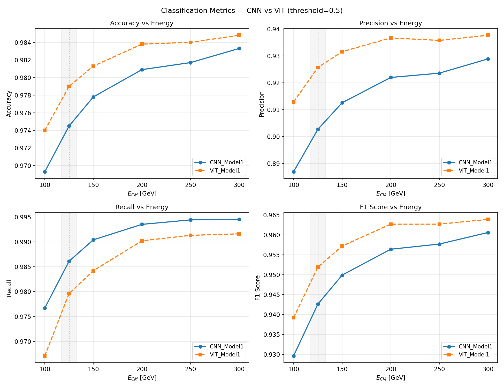
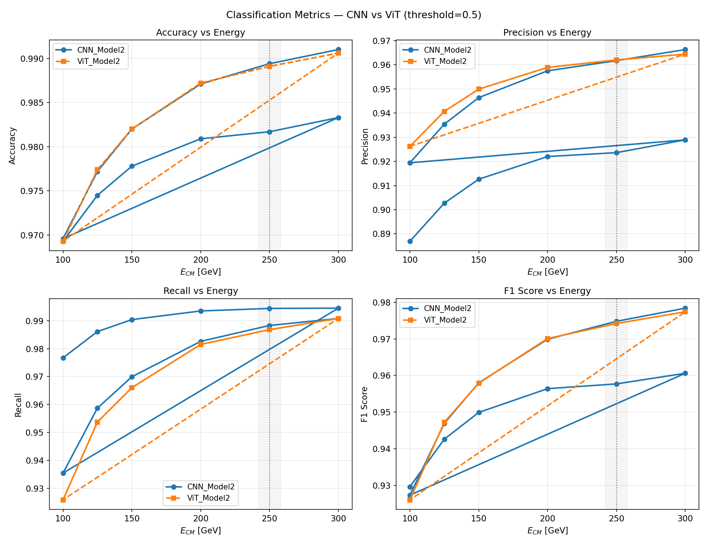

# Hadronic Tau Jet Tagging at an e⁺e⁻ Collider using Deep Learning

A deep learning study for hadronic tau jet identification in e⁺e⁻ collisions using the ILD
detector simulation. Models are trained on jet images and evaluated across a range of
centre-of-mass energies to probe cross-energy generalisation. This project is part of an
MSc upgrade and is **actively being developed — results and documentation will be updated
regularly**.

---

## Physics motivation

### The tau lepton

The tau (τ) is the third-generation charged lepton in the Standard Model:

- Discovered by **Martin Perl** in 1975 at SLAC
- Heaviest lepton: mass ≈ **1777.6 MeV**
- Very short lifetime: ≈ **2.90 × 10⁻¹³ s**
- Nearly **64.8%** of tau decays are hadronic, producing narrow, collimated **tau jets**

### The process: e⁺e⁻ → τ⁺τ⁻

The relevant QED Lagrangian for this process is:

$$\mathcal{L}^{\text{QED}} = \mathcal{L}_e^{\text{Dirac}} + \mathcal{L}_\tau^{\text{Dirac}} + \mathcal{L}^{\text{Maxwell}} + \mathcal{L}^{\text{Int}}$$

where the interaction term is:

$$\mathcal{L}^{\text{Int}} = -e\,\bar{\hat{\psi}}_e\,\gamma^\mu\hat{\psi}_e\hat{A}_\mu \;-\; e\,\bar{\hat{\psi}}_\tau\,\gamma^\mu\hat{\psi}_\tau\hat{A}_\mu$$

This project considers only **tree-level diagrams** (no loop corrections). At tree level,
e⁺e⁻ → τ⁺τ⁻ proceeds via s-channel virtual photon (γ*) exchange. The leading-order
cross section scales as σ ∝ 1/s, where √s is the centre-of-mass energy.

The two main background processes considered are:

- **e⁺e⁻ → jj** (light quark dijet) — s-channel γ*/Z exchange
- **e⁺e⁻ → bb̄** (bottom quark pair) — same topology, heavier flavour

### Why tau jet tagging matters

Tau jet classification is central to Higgs physics: the Higgs boson decays to tau pairs
(H → τ⁺τ⁻) with a branching ratio of **≈ 6.3%**, making it one of the most important
fermionic decay channels. Identifying hadronic tau decays enables precise measurements of
the Higgs–tau Yukawa coupling and tests of Standard Model predictions. In the clean e⁺e⁻
environment of the ILC/ILD detector, the absence of pileup and underlying event allows
detailed study of jet substructure — making it an ideal setting to benchmark deep learning
taggers and probe their generalisation across centre-of-mass energies.

---

## Simulation pipeline

```
MadGraph5  →  Pythia8  →  HepMC3  →  Delphes 3.5.1 (ILD card)  →  ROOT
```

- Hard process generation: MadGraph5 (tree-level, LHE output)
- Parton shower + hadronisation + tau decay: Pythia8 (hadronic τ decays enforced)
- Detector simulation: Delphes 3.5.1 with modified `delphes_card_ILD.tcl`
- Jet algorithm: anti-kT, R = 0.4, pT_min = 15 GeV, N-subjettiness enabled

For full details of the generation steps, run cards, and sample sizes, see
[`generation/README.md`](generation/README.md).

---

## Processes and samples

### Training sets

| Process | Role | √s | Events | pT window |
|---|---|---|---|---|
| e⁺e⁻ → τ⁺τ⁻ | Signal | 125 GeV | 175k | 15–60 GeV |
| e⁺e⁻ → jj | Background | 125 GeV | 80k | 15–60 GeV |
| e⁺e⁻ → bb̄ | Background | 125 GeV | 60k | 15–60 GeV |
| e⁺e⁻ → τ⁺τ⁻ | Signal | 250 GeV | 175k | 15–125 GeV |
| e⁺e⁻ → jj | Background | 250 GeV | 80k | 15–125 GeV |
| e⁺e⁻ → bb̄ | Background | 250 GeV | 60k | 15–125 GeV |

After jet selection, the 125 GeV training set contains 441,890 jets
(178k τ, 148k jj, 115k bb̄) — signal:background ratio of 1:1.48.

### Test sets

50k events per process at each energy, generated with **independent random seeds**
from the training sets to ensure no event overlap.

| Test √s | pT ceiling |
|---|---|
| 100 GeV | ~50 GeV |
| 125 GeV | 60 GeV |
| 150 GeV | ~75 GeV |
| 200 GeV | ~100 GeV |
| 250 GeV | 125 GeV |
| 300 GeV | ~145 GeV |

### Jet images

Each jet is represented as a **32×32 pixel image** in the η-φ plane with 3 channels:
EFlowTrack, EFlowPhoton, EFlowNeutralHadron. Preprocessing: η-φ centering,
PCA rotation, energy flip, L2 normalisation.

---

## Models

| Model | Architecture | Params | Train √s | Val AUC |
|---|---|---|---|---|
| JetCNN (model1) | 4-layer CNN + FC head | 766k | 125 GeV | 0.9961 |
| JetCNN (model2) | 4-layer CNN + FC head | 766k | 250 GeV | 0.9988 |
| JetViT (model1) | Vision Transformer (depth=4) | 545k | 125 GeV | 0.9969 |
| JetViT (model2) | Vision Transformer (depth=4) | 545k | 250 GeV | 0.9988 |

Both models use BCEWithLogitsLoss with class weighting, AUC-based early stopping,
and ReduceLROnPlateau scheduling. CNN uses Adam; ViT uses AdamW with weight decay.
Full architecture details are in [`utils/README.md`](utils/README.md).

---

## Results

### Cross-energy AUC

| Test √s | CNN@125 | CNN@250 | ViT@125 | ViT@250 |
|---|---|---|---|---|
| 100 GeV | 0.9944 | 0.9938 | 0.9957 | 0.9937 |
| 125 GeV | 0.9964 | 0.9962 | 0.9971 | 0.9963 |
| 150 GeV | 0.9975 | 0.9975 | 0.9978 | 0.9976 |
| 200 GeV | 0.9983 | 0.9986 | 0.9984 | 0.9986 |
| 250 GeV | 0.9986 | 0.9989 | 0.9986 | 0.9989 |
| 300 GeV | 0.9988 | 0.9992 | 0.9987 | 0.9991 |

### CNN vs ViT — model1 (trained at 125 GeV)



The model1 comparison reveals a clear **precision–recall trade-off** between architectures.
At 100 GeV (hardest out-of-distribution test):

- **CNN@125**: recall = 0.883, precision = 0.950 — conservative, high-purity tagger
- **ViT@125**: recall = 0.967, precision = 0.913 — aggressive, high-completeness tagger

The AUC values are nearly identical (max Δ = 0.0005), meaning both models have the same
underlying discriminating power — the difference is purely a threshold=0.5 effect. The ViT's
attention mechanism assigns higher scores to tau jets, shifting the operating point toward
higher recall. The F1 crossover occurs around 175–200 GeV.


At 90% signal efficiency, the ViT achieves higher background rejection at all energies
below 200 GeV — confirming it is the better model for high-efficiency tau selection.

### CNN vs ViT — model2 (trained at 250 GeV)



Training on the wider 15–125 GeV pT window causes the precision–recall split to almost
completely disappear. CNN and ViT curves overlap across all 6 test energies for every metric.
This shows the model1 split was not a fundamental architectural difference — it was a
consequence of the narrower training distribution. Given sufficient training diversity,
both architectures converge to equivalent performance.

### Key observations

- All four models achieve AUC > 0.993 across the full 100–300 GeV range despite being
  trained at a single energy, demonstrating strong cross-energy generalisation
- Performance improves monotonically with test energy — higher √s produces more collimated,
  energetically distinct tau jets, making image-based classification intrinsically easier
- CNN@125 is the highest-precision classifier; ViT@125 achieves the highest recall and
  event-tagging efficiency at lower energies out-of-distribution
- The precision–recall trade-off vanishes for model2: a wider training pT window removes
  the architectural distinction entirely

---

## Repository structure

```
tau-jet-classification-ml/
├── generation/
│   ├── pythia_scripts/       ← bb.cc, jj.cc, tau.cc
│   ├── hepmc_files/          ← (not stored, see README)
│   ├── LHE_files/            ← (not stored, see README)
│   ├── root_files/           ← (not stored, see README)
│   └── README.md
├── datasets/
│   ├── cnn_vit/              ← training .npz files (not stored)
│   └── README.md
├── notebooks/
│   ├── 01_kinematics_analysis.ipynb
│   ├── 02_jet_images_dataset.ipynb
│   ├── 03_Comparison_CNN_Vs_ViT.ipynb
│   ├── CNN/
│   │   ├── CNN.ipynb
│   │   └── CNN_models_training.ipynb
│   ├── ViT/
│   │   ├── ViT.ipynb
│   │   └── ViT_models_training.ipynb
│   └── README.md
├── results_analysis/
│   ├── cnn/
│   ├── vit/
│   ├── comparison/
│   ├── jet_images/
│   ├── kinematics/
│   └── README.md
├── utils/
│   ├── dataset.py
│   ├── modelarch.py
│   └── README.md
├── .gitignore
├── LICENSE
└── README.md
```

> Datasets (`.npz`), ROOT files, and model checkpoints (`.pt`) are excluded via
> `.gitignore`. Model weights are available on request.

---

## Roadmap

- [x] Event generation pipeline (MadGraph5 + Pythia8 + Delphes)
- [x] Jet image dataset construction and preprocessing
- [x] JetCNN — trained at 125 GeV and 250 GeV
- [x] JetViT — trained at 125 GeV and 250 GeV
- [x] Cross-energy evaluation (100–300 GeV) for CNN and ViT
- [x] CNN vs ViT comparison analysis
- [ ] BDT baseline using tabular jet features
- [ ] Graph Neural Network (GNN) using particle-level inputs
- [ ] Late-fusion ensemble (CNN + ViT + BDT + GNN)
- [ ] Full results writeup and comparison

---

## Requirements

```
python >= 3.9
torch >= 2.0
numpy
uproot
awkward
scikit-learn
matplotlib
scipy
```

```bash
pip install -r requirements.txt
```

---

## License

This project is licensed under the MIT License — see [LICENSE](LICENSE) for details.

---

*This repository is part of an ongoing MSc project. Expect regular updates.*
